# What is the difference between `download zip` and `open in desktop`?
* `download zip` - downloads to the computer the current project in github, and from this moment we can not connect to github and `pull` or `push` to the repo in github.
* `open in desktop` - clones the repo to the local computer. and from this moment we can connect to github and `pull` or `push` to the repo in github.

# Manage Repo in GITHUB with the website
* Edit fieles or upload new fieles
* commit the changes in the website   

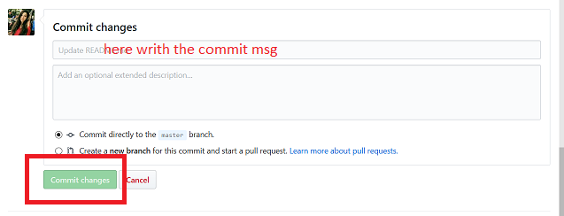  
* Pull the changes to *github desktop*   
 

# Manage Repo in GITHUB with github-desktop

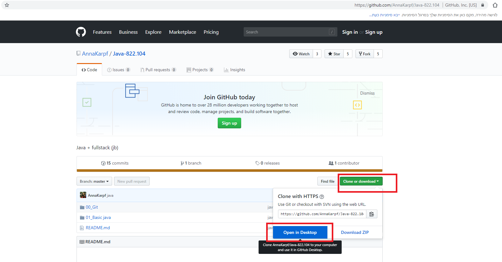   

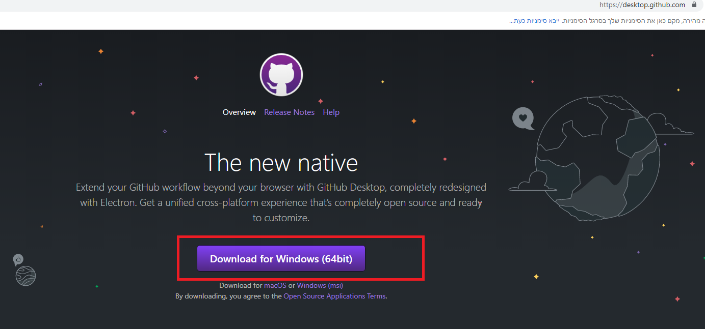   

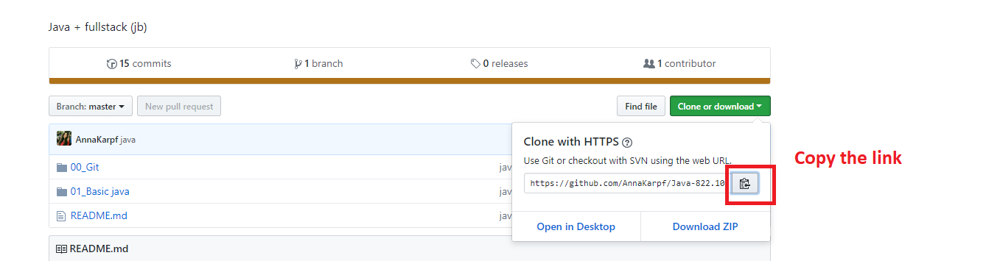   

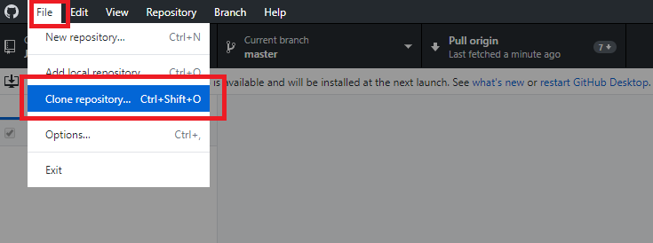   

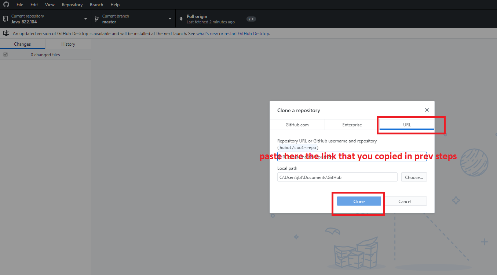   

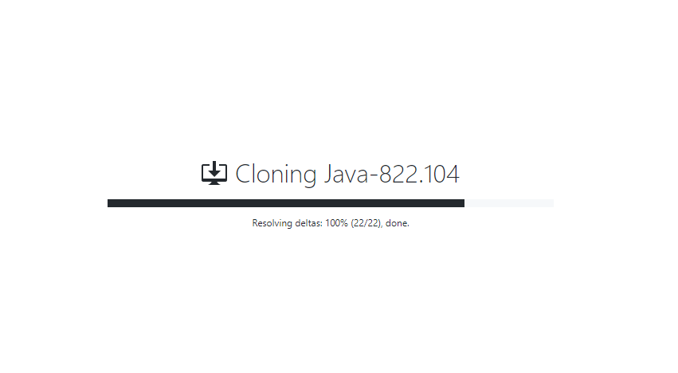   

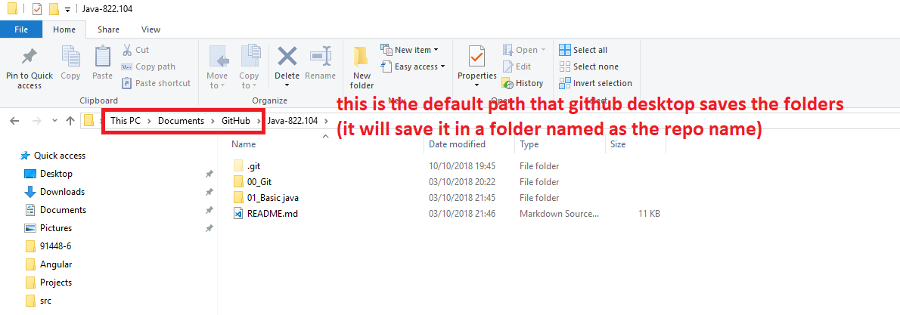   

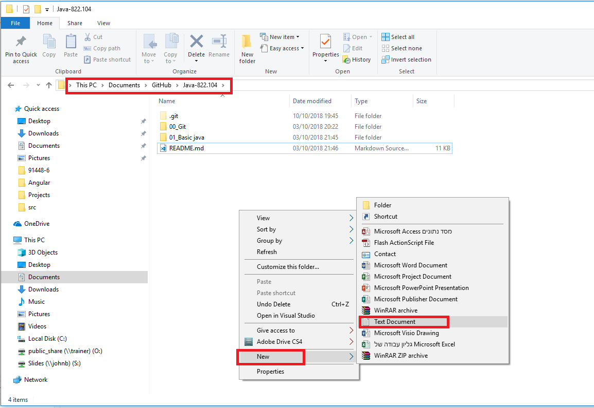   

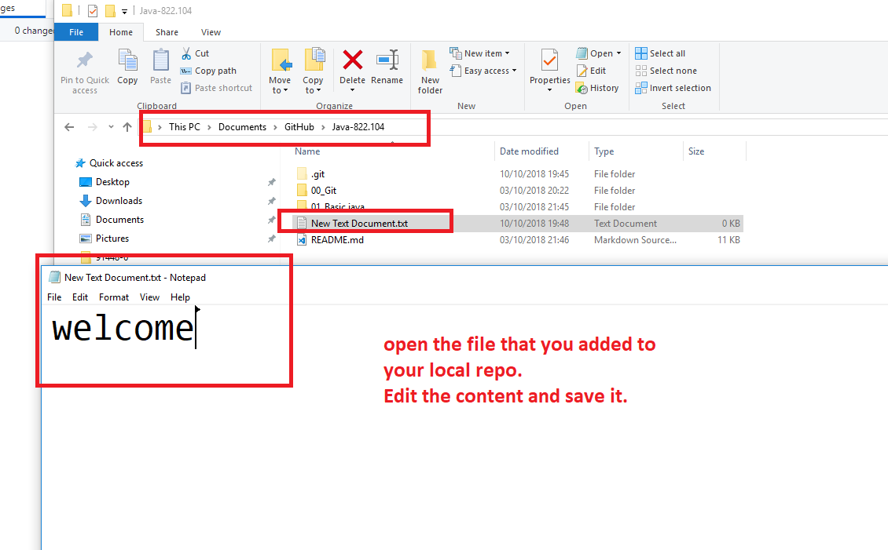   

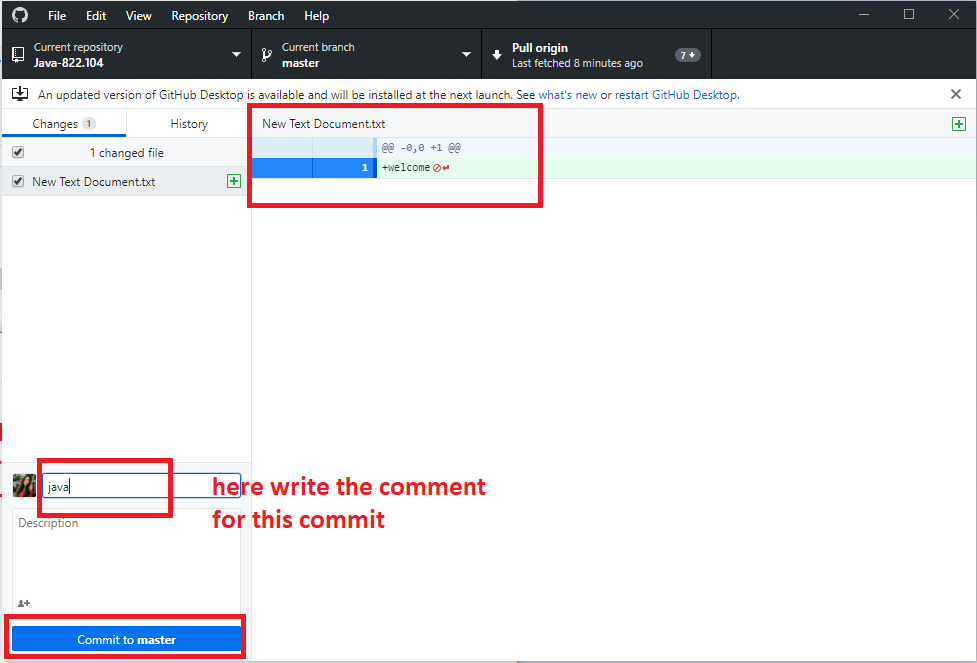   

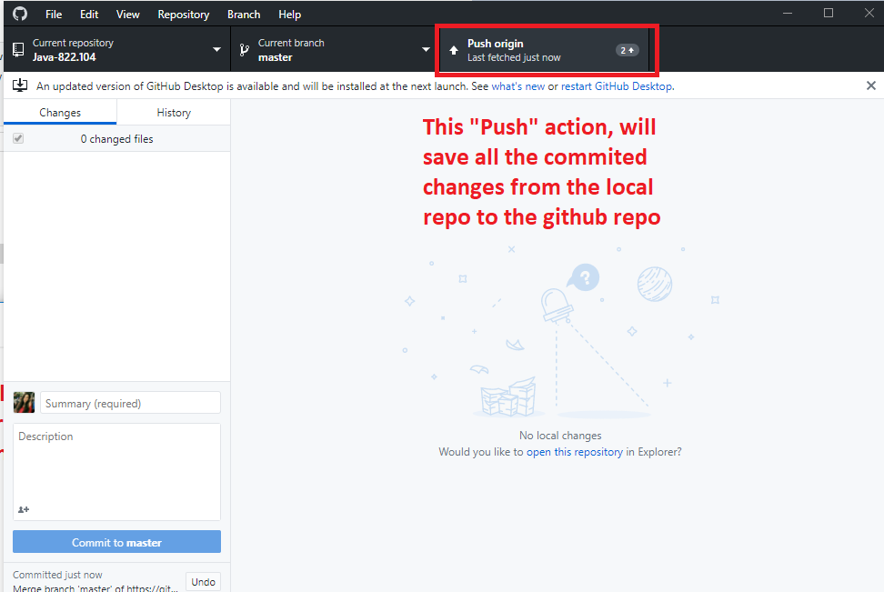
