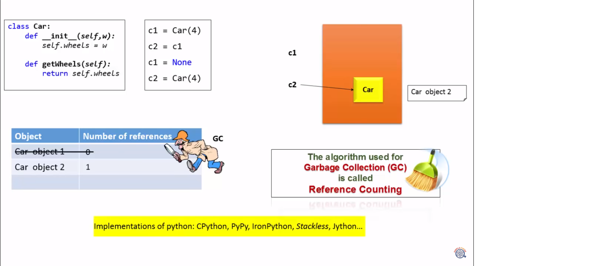
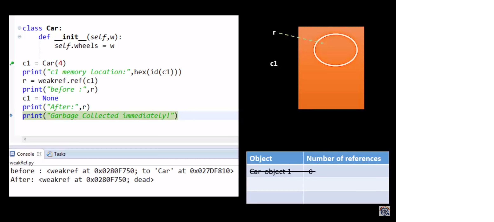
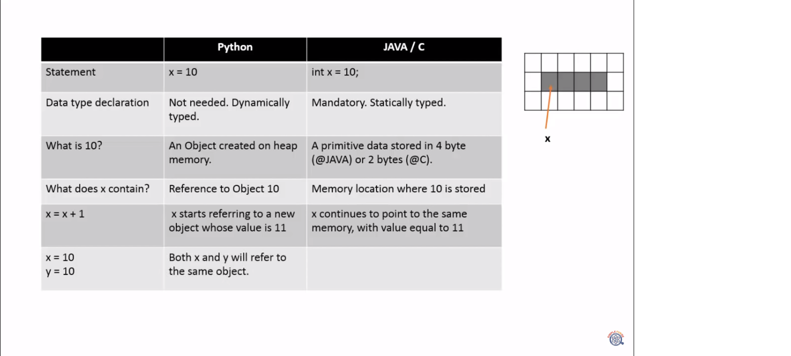

# Python Interview
###### welcome to our Interview
###### Every thing in Python is Object!!
### Question number 1:
* what is Python really? you can (and encouraged) make comparisons to other technologies in your answer:
    * Python is an interpreted language, that means that, unlike language like C and its variants, Python does not need to be compiled before it is run.
    other interpreted language include PHP and Ruby.
    * Python is dynamically tyoed, this means that you don't need to state the types of variables when you declare them or anything like that. You can do things like x=111 and then x="I'm a string" whithout error.
    * Python finds use in many spheres - web applications, automation, scientific modelling, big data applications and many more. It's also often used as "glue" code to get other languages and components to play nice.
---
### Question number 2:
* Fill in the missing code:
    ```
    def print_directory_contents(sPath):
    """
    This function takes the name of a directory 
    and prints out the paths files within that 
    directory as well as any files contained in 
    contained directories. 

    This function is similar to os.walk. Please don't
    use os.walk in your answer. We are interested in your 
    ability to work with nested structures. 
    """
    fill_this_in
    ```
* Result:
    ```
    def print_directory_contents(sPath):
    import os
    for sChild in os.listdir(sPath):
        sChildPath = os.path.join(sPath,sChild)
        if os.path.isdir(sChildPath):
            print_directory_contents(sChildPath)
        else:
            print(sChildPath)
    ```
---
### Question number 3:
* Looking at the below code, write down the final values of A0, A1, ...An.
    ```
    A0 = dict(zip(('a','b','c','d','e'),(1,2,3,4,5)))
    A1 = range(10)
    A2 = sorted([i for i in A1 if i in A0])
    A3 = sorted([A0[s] for s in A0])
    A4 = [i for i in A1 if i in A3]
    A5 = {i:i*i for i in A1}
    A6 = [[i,i*i] for i in A1]
    ```
    * If you dont know what zip is don't stress out. No sane employer will expect you to memorize the standard library. Here is the output of help(zip).
    ```
    zip(...)
        zip(seq1 [, seq2 [...]]) -> [(seq1[0], seq2[0] ...), (...)]
        
        Return a list of tuples, where each tuple contains the i-th element
        from each of the argument sequences.  The returned list is truncated
        in length to the length of the shortest argument sequence.
    ```
* Answer
    ```
    A0 = {'a': 1, 'c': 3, 'b': 2, 'e': 5, 'd': 4}  # the order may vary
    A1 = range(0, 10) # or [0, 1, 2, 3, 4, 5, 6, 7, 8, 9] in python 2
    A2 = []
    A3 = [1, 2, 3, 4, 5]
    A4 = [1, 2, 3, 4, 5]
    A5 = {0: 0, 1: 1, 2: 4, 3: 9, 4: 16, 5: 25, 6: 36, 7: 49, 8: 64, 9: 81}
    A6 = [[0, 0], [1, 1], [2, 4], [3, 9], [4, 16], [5, 25], [6, 36], [7, 49], [8, 64], [9, 81]]
    ```
---
### Question number 4:
* Python and multi-threading. Is it a good idea? List some ways to get some Python code to run in a parallel way.

    * Python doesn't allow multi-threading in the truest sense of the word. It has a multi-threading package but if you want to multi-thread to speed your code up, then it's usually not a good idea to use it. Python has a construct called the Global Interpreter Lock (GIL). The GIL makes sure that only one of your 'threads' can execute at any one time. A thread acquires the GIL, does a little work, then passes the GIL onto the next thread. This happens very quickly so to the human eye it may seem like your threads are executing in parallel, but they are really just taking turns using the same CPU core. All this GIL passing adds overhead to execution. This means that if you want to make your code run faster then using the threading package often isn't a good idea.

        There are reasons to use Python's threading package. If you want to run some things simultaneously, and efficiency is not a concern, then it's totally fine and convenient. Or if you are running code that needs to wait for something (like some IO) then it could make a lot of sense. But the threading library won't let you use extra CPU cores.

        Multi-threading can be outsourced to the operating system (by doing multi-processing), some external application that calls your Python code (eg, Spark or Hadoop), or some code that your Python code calls (eg: you could have your Python code call a C function that does the expensive multi-threaded stuff).
---
### Question number 5:
* How do you keep track of different versions of your code?
    * Version control! At this point, you should act excited and tell them how you even use Git (or whatever is your favorite) to keep track of correspondence with Granny. Git is my preferred version control system, but there are others, for example subversion.
---
### Question number 6:
* What does this code output:
    ```
    def f(x,l=[]):
        for i in range(x):
            l.append(i*i)
        print(l) 

    f(2)
    f(3,[3,2,1])
    f(3)
    ```
* Result:
    ```
    [0, 1]
    [3, 2, 1, 0, 1, 4]
    [0, 1, 0, 1, 4]
    ```
* for Understanding: 
    ```
    l_mem = []

    l = l_mem           # the first call
    for i in range(2):
        l.append(i*i)

    print(l)            # [0, 1]

    l = [3,2,1]         # the second call
    for i in range(3):
        l.append(i*i)

    print(l)            # [3, 2, 1, 0, 1, 4]

    l = l_mem           # the third call
    for i in range(3):
        l.append(i*i)

    print(l)            # [0, 1, 0, 1, 4]
    ```
---
### Question number 7:
* What is monkey patching and is it ever a good idea? 
    * Monkey patching is changing the behaviour of a function or object after it has already been defined. For example:
    ```
    import datetime
    datetime.datetime.now = lambda: datetime.datetime(2012, 12, 12)
    ```
    
    * Most of the time it's a pretty terrible idea - it is usually best if things act in a well-defined way. One reason to monkey patch would be in testing. The mock package is very useful to this end.

---
### Question number 8:
* What do these mean to you: @classmethod, @staticmethod, @property?
    * These are decorators. A decorator is a special kind of function that either takes a function and returns a function, or takes a class and returns a class. The @ symbol is just syntactic sugar that allows you to decorate something in a way that's easy to read.
    ```
    @my_decorator
    def my_func(stuff):
        do_things
    ```
* Is equivalent to:
    ```
    def my_func(stuff):
        do_things

    my_func = my_decorator(my_func)
    ```
* Actual Answer:
    * The decorators @classmethod, @staticmethod and @property are used on functions defined within classes. Here is how they behave:
    ```
    class MyClass(object):
        def __init__(self):
            self._some_property = "properties are nice"
            self._some_other_property = "VERY nice"
        def normal_method(*args,**kwargs):
            print("calling normal_method({0},{1})".format(args,kwargs))
        @classmethod
        def class_method(*args,**kwargs):
            print("calling class_method({0},{1})".format(args,kwargs))
        @staticmethod
        def static_method(*args,**kwargs):
            print("calling static_method({0},{1})".format(args,kwargs))
        @property
        def some_property(self,*args,**kwargs):
            print("calling some_property getter({0},{1},{2})".format(self,args,kwargs))
            return self._some_property
        @some_property.setter
        def some_property(self,*args,**kwargs):
            print("calling some_property setter({0},{1},{2})".format(self,args,kwargs))
            self._some_property = args[0]
        @property
        def some_other_property(self,*args,**kwargs):
            print("calling some_other_property getter({0},{1},{2})".format(self,args,kwargs))
            return self._some_other_property

    o = MyClass()
    # undecorated methods work like normal, they get the current instance (self) as the first argument

    o.normal_method 
    # <bound method MyClass.normal_method of <__main__.MyClass instance at 0x7fdd2537ea28>>

    o.normal_method() 
    # normal_method((<__main__.MyClass instance at 0x7fdd2537ea28>,),{})

    o.normal_method(1,2,x=3,y=4) 
    # normal_method((<__main__.MyClass instance at 0x7fdd2537ea28>, 1, 2),{'y': 4, 'x': 3})

    # class methods always get the class as the first argument

    o.class_method
    # <bound method classobj.class_method of <class __main__.MyClass at 0x7fdd2536a390>>

    o.class_method()
    # class_method((<class __main__.MyClass at 0x7fdd2536a390>,),{})

    o.class_method(1,2,x=3,y=4)
    # class_method((<class __main__.MyClass at 0x7fdd2536a390>, 1, 2),{'y': 4, 'x': 3})

    # static methods have no arguments except the ones you pass in when you call them

    o.static_method
    # <function static_method at 0x7fdd25375848>

    o.static_method()
    # static_method((),{})

    o.static_method(1,2,x=3,y=4)
    # static_method((1, 2),{'y': 4, 'x': 3})

    # properties are a way of implementing getters and setters. It's an error to explicitly call them
    # "read only" attributes can be specified by creating a getter without a setter (as in some_other_property)

    o.some_property
    # calling some_property getter(<__main__.MyClass instance at 0x7fb2b70877e8>,(),{})
    # 'properties are nice'

    o.some_property()
    # calling some_property getter(<__main__.MyClass instance at 0x7fb2b70877e8>,(),{})
    # Traceback (most recent call last):
    #   File "<stdin>", line 1, in <module>
    # TypeError: 'str' object is not callable

    o.some_other_property
    # calling some_other_property getter(<__main__.MyClass instance at 0x7fb2b70877e8>,(),{})
    # 'VERY nice'

    # o.some_other_property()
    # calling some_other_property getter(<__main__.MyClass instance at 0x7fb2b70877e8>,(),{})
    # Traceback (most recent call last):
    #   File "<stdin>", line 1, in <module>
    # TypeError: 'str' object is not callable

    o.some_property = "groovy"
    # calling some_property setter(<__main__.MyClass object at 0x7fb2b7077890>,('groovy',),{})

    o.some_property
    # calling some_property getter(<__main__.MyClass object at 0x7fb2b7077890>,(),{})
    # 'groovy'

    o.some_other_property = "very groovy"
    # Traceback (most recent call last):
    #   File "<stdin>", line 1, in <module>
    # AttributeError: can't set attribute

    o.some_other_property
    # calling some_other_property getter(<__main__.MyClass object at 0x7fb2b7077890>,(),{})
    # 'VERY nice'
    ```
---
### Question number 9:
* Consider the following code, what will it output?
    ```
    class A(object):
        def go(self):
            print("go A go!")
        def stop(self):
            print("stop A stop!")
        def pause(self):
            raise Exception("Not Implemented")

    class B(A):
        def go(self):
            super(B, self).go()
            print("go B go!")

    class C(A):
        def go(self):
            super(C, self).go()
            print("go C go!")
        def stop(self):
            super(C, self).stop()
            print("stop C stop!")

    class D(B,C):
        def go(self):
            super(D, self).go()
            print("go D go!")
        def stop(self):
            super(D, self).stop()
            print("stop D stop!")
        def pause(self):
            print("wait D wait!")

    class E(B,C): pass

    a = A()
    b = B()
    c = C()
    d = D()
    e = E()

    # specify output from here onwards

    a.go()
    b.go()
    c.go()
    d.go()
    e.go()

    a.stop()
    b.stop()
    c.stop()
    d.stop()
    e.stop()

    a.pause()
    b.pause()
    c.pause()
    d.pause()
    e.pause()
    ```
* Result:
```
a.go()
# go A go!

b.go()
# go A go!
# go B go!

c.go()
# go A go!
# go C go!
 
d.go()
# go A go!
# go C go!
# go B go!
# go D go!

e.go()
# go A go!
# go C go!
# go B go!

a.stop()
# stop A stop!

b.stop()
# stop A stop!

c.stop()
# stop A stop!
# stop C stop!

d.stop()
# stop A stop!
# stop C stop!
# stop D stop!

e.stop()
# stop A stop!
 
a.pause()
# ... Exception: Not Implemented

b.pause()
# ... Exception: Not Implemented

c.pause()
# ... Exception: Not Implemented

d.pause()
# wait D wait!

e.pause()
# ...Exception: Not Implemented
```
---
### Question number 10:
* Describe Python's garbage collection mechanism in brief.
    * A lot can be said here. There are a few main points that you should mention:

        Python maintains a count of the number of references to each object in memory. If a reference count goes to zero then the associated object is no longer live and the memory allocated to that object can be freed up for something else
        occasionally things called "reference cycles" happen. The garbage collector periodically looks for these and cleans them up. An example would be if you have two objects o1 and o2 such that o1.x == o2 and o2.x == o1. If o1 and o2 are not referenced by anything else then they shouldn't be live. But each of them has a reference count of 1.
        Certain heuristics are used to speed up garbage collection. For example, recently created objects are more likely to be dead. As objects are created, the garbage collector assigns them to generations. Each object gets one generation, and younger generations are dealt with first.

---
### Question number 11:
* Something you failed at?
    * I never fail!
---
### Question number 12:
* Do you have any personal projects?
    * Really?
        This shows that you are willing to do more than the bare minimum in terms of keeping your skillset up to date. If you work on personal projects and code outside of the workplace then employers are more likely to see you as an asset that will grow. Even if they don't ask this question I find it's useful to broach the subject.

---
### Question number 13:
* What are the supported data types in Python?
    * Python has five standard data types −

        * Numbers

        * String

        * List

        * Tuple

        * Dictionary
---
### Question number 14:
* What are tuples in Python?
    * A tuple is another sequence data type that is similar to the list. A tuple consists of a number of values separated by commas. Unlike lists, however, tuples are enclosed within parentheses.
---
### Question number 15:
*  What is the difference between list and tuple?
    * The difference between list and tuple is that list is mutable while tuple is not. Tuple can be hashed for e.g as a key for dictionaries.
---
### Question number 16:
*  What is lambda in Python?
    * It is a single expression anonymous function often used as inline function.
```
בהכללה, פונקצית למבדה היא פונקציה המקבלת כל מספר של ארגומנטים, כולל ארגומנטים אופציונליים, ומחזירה ערך יחיד. ביטוי למבדה אינו יכול להכיל פקודות מורכבות או יותר מביטוי יחיד.
```
---
### Question number 17:
*  How you can convert a number to a string?
    * In order to convert a number into a string, use the inbuilt function str(). If you want a octal or hexadecimal representation, use the inbuilt function oct() or hex().
---
### Question number 18:
*  What is module and package in Python?
    * In Python, module is the way to structure program. Each Python program file is a module, which imports other modules like objects and attributes.

        The folder of Python program is a package of modules. A package can have modules or subfolders.
---
### Question number 19:
*  3 classes, A, B and C, A inherited by B and C, I created  instance of B and want to access variable of C which should be run time constant, or something like monkey patching,
---
### Question number 20:
* Write code to check if string is a palindrome.
* way 1
    ```
    # Python program to check 
    # if a string is palindrome  
    # or not  
    x = "abba"
    w = "" 
    for i in x: 
        w = i + w 
    if (x==w): 
            print("Polidrome !")
    else:
        print("not a Polidrome !")      
    ```
* way 2
    ```
    # Program to check if a string
    #  is palindrome or not

    # change this value for a different output
    my_str = 'abba'
    # make it suitable for caseless comparison
    #my_str = my_str.casefold()

    # reverse the string
    rev_str = reversed(my_str)

    # check if the string is equal to its reverse
    if list(my_str) == list(rev_str):
    print("It is palindrome")
    else:
    print("It is not palindrome")
    ```
---
### Question number 21:
* Thread:
    * The threading module builds on the low-level features of thread to make working with threads even easier and more pythonic. Using threads allows a program to run multiple operations concurrently in the same process space.
    ```
    import threading
    import time

    def worker():
        print(threading.currentThread().getName(), 'Starting')
        time.sleep(5)
        print (threading.currentThread().getName(), 'Exiting')

    def my_service():
        print (threading.currentThread().getName(), 'Starting')
        time.sleep(5)
        print (threading.currentThread().getName(), 'Exiting')

    t = threading.Thread(name='my_service', target=my_service)
    w = threading.Thread(name='worker', target=worker)
    w2 = threading.Thread(target=worker) # use default name

    w.start()
    w2.start()
    t.start()

    ```
    * output:
    ```
    worker Starting
    Thread-1 Starting
    my_service Starting
    worker Exiting
    Thread-1 Exiting
    my_service Exiting
    ```
---
### Memory Python
 





#### Summary: 
* The methods and variables are created on stack memory.
* The object and instance variables are created on heap memory.
* A new stack frame is created on invocation of a function/method.
* Stack frames are destroyed as soon the function/method returns. 
---
### Question:
```
פונקציה שמקבלת מחרוזת ומחזירה את המחרוזת עם סדר מילים זהה
 רק שהאותיות
  במילים הפוכות. זא: This is Python צריך לחזור מהפונקציה כ-sihT si nohtyP. 
  צריך להשתמש במתודות
   split לקבל רשימה של מילים ואז לעשות איטרציה
    על הרשימה ולהשתמש בכל מילה במתודה reverse. 
    את הפלט צריך לשרשר לפרמטר שמוחזק מחוץ לפונקציה. בסוף להחזיר את הפרמטר החדש
```
* RESULT:
```
def rev(self):
    b=""
    for i in self:
        b=i+b
    self=b
    return self


func=rev("shadi")
print(func)
```
##### output:
    python .\app.py
    -->>   idahs
---
### Question 
* Write code on Python (in fact on peace of paper). You have 2 dices, how many times program will need to "cycle" to get 12 from both dices.
    * Simple "while" cycle with "count" integer and randint library.
---
#### Data Structures (list, dict, tuples, sets, strings)
---
```
def rev(self):
    b=""
    for i in self:
        b=i+b
    self=b
    return self


func=rev("shadi")
print(func)

```
#### !@#$%^&*&1!@#!@#!
```
a, b = 0,1
for i in range(0,10):
    print(a)
    a, b = b, a + b
```
#### !@#$%^&*&1!@#!@#!
```
aa={10,20,30,40,50,10,20,30,40,50}
for i in aa:
    print(i)
```
#### !@#$%^&*&1!@#!@#!
```
# give me each number in a list square.
listt=[1,2,3,4,5,6,7,8,9,10]
square=[num*num for num in listt]
print(square)

```
#### !@#$%^&*&1!@#!@#!
```
# fibonacci Generator
def fib(num):
    a,b=0,1
    for i in range(0,num):
        yield "{}: {}".format(i+1,a)
        a,b = b,a+b
for item in fib(10):
    print(item)
```

###### Shadi Bdair
